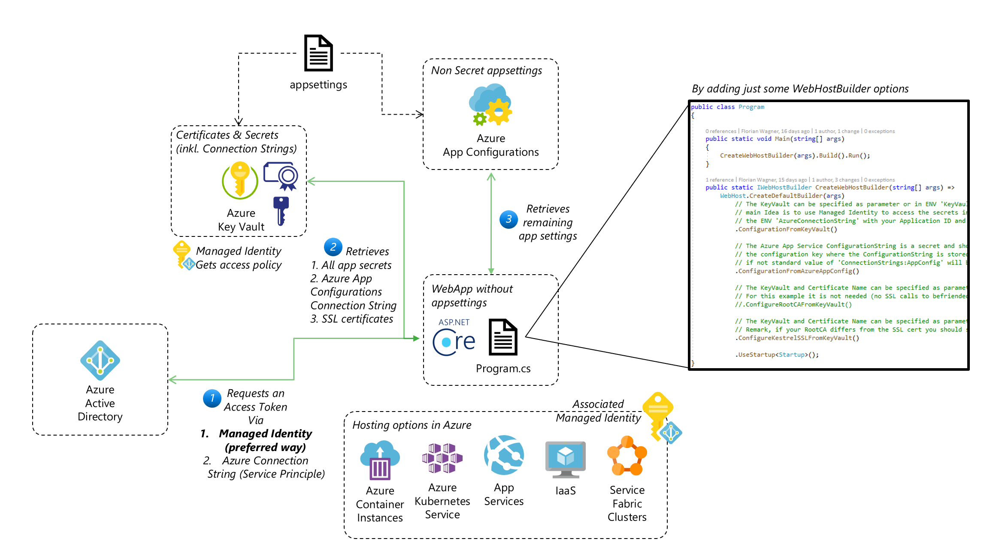

# SecureAzure Samples and Helper Library Collection

This repo is to show several examples on how to leverage Azure Services to secure WebServices (mainly .NET Core) and also how to achieve authentication through Azure Active Directory features.

## CSE.SecureWebServerHelper NuGet package

For usage information and sources of the public NuGet package please click [here](SecureWebServerHelper/).

This is the architectural idea:

## AADLogin Sample

This sample leverages some features of the CSE.SecureWebServerHelper NuGet package, but also includes authentication (login) with Azure Active Directory and using roles defined in AAD. Click [here](AADLogin/) for more information.

## Microservice Sample

To be continued...

## Importing SSL Certificates from Azure Key Vault

The feature is now included in CSE.SecureWebServerHelper NuGet package and can be seen as a easy to understand sample where only the necessary parts for for the SSL certificates is used directly in `Program.cs` [here](SSL/).
